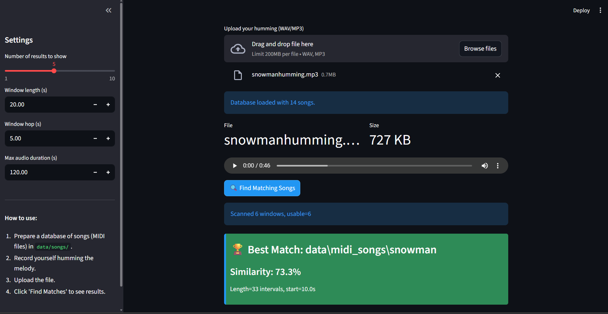

#🎵 Humming Song Finder

A music information retrieval system that identifies songs from hummed melodies. Upload a recording of yourself humming a tune, and the system will search through a MIDI song database to find the best matches.



## Features

- **Melody Extraction**: Converts hummed audio recordings to symbolic melody representations using pitch tracking (YIN algorithm)
- **MIDI Database**: Processes MIDI files to extract melody lines and build a searchable database
- **Intelligent Matching**: Uses dynamic programming with multi-feature alignment (interval, contour, timing, absolute pitch)
- **Windowed Search**: Analyzes multiple segments of your humming to find the best match
- **Interactive UI**: User-friendly Streamlit interface with configurable search parameters

## How It Works

1. **Database Building**: MIDI songs are processed to extract melody notes and converted into interval-contour representations
2. **Audio Processing**: Your humming is analyzed using YIN pitch tracking, converting audio to MIDI note events
3. **Melody Representation**: Both database songs and queries are represented using:
   - Pitch intervals (difference between consecutive notes)
   - Melodic contour (up/down/same direction)
   - Inter-onset intervals (timing between notes)
4. **Similarity Matching**: Dynamic programming alignment compares query melody against all database entries, scoring based on:
   - Interval similarity
   - Contour matching
   - Timing ratio consistency
   - Absolute pitch (tie-breaker)

## Prerequisites

- Python 3.8+
- Required packages (see Installation)

## 🔧 Installation

1. Clone this repository:
```bash
git clone <repository-url>
cd Humming-to-song
```

2. Create a virtual environment (recommended):
```bash
python -m venv .venv
.venv\Scripts\activate  # On Windows
# source .venv/bin/activate  # On Linux/Mac
```

3. Install dependencies:
```bash
pip install -r requirements.txt
```

Required packages include:
- `streamlit` - Web interface
- `librosa` - Audio processing
- `numpy` - Numerical computations
- `scipy` - Signal processing
- Additional dependencies as needed

##  Project Structure

```
Humming-to-song/
├── app.py                    # Main Streamlit application
├── config.py                 # Configuration settings
├── README.md                 # This file
├── ui.png                    # UI screenshot
├── data/
│   ├── midi_songs/          # Place your MIDI files here
│   ├── db/                  # Auto-generated database
│   │   ├── melody_db.json   # Processed melody database
│   │   └── bad_midis.txt    # Log of failed MIDI files
│   └── queries/             # Sample query recordings
├── src/
│   ├── audio_query.py       # Audio to melody conversion
│   ├── audio_to_midi.py     # Pitch tracking and note extraction
│   ├── database.py          # Database building and management
│   ├── melody_repr.py       # Melody representation
│   ├── midi_io.py           # MIDI file processing
│   ├── similarity.py        # DP-based similarity matching
│   └── utils.py             # Utility functions
├── midi_output/             # Converted MIDI outputs
└── temp_midi/               # Temporary MIDI files
```

##  Usage

### Step 1: Prepare Your Song Database

Place MIDI files (.mid or .midi) in the `data/midi_songs/` directory. The system will automatically build a database on first run.

### Step 2: Launch the Application

```bash
streamlit run app.py
```

The app will open in your default browser at `http://localhost:8501`

### Step 3: Search for a Song

1. **Record your humming**: Use any audio recording app to capture yourself humming a melody (WAV or MP3 format)
2. **Upload the file**: Click the upload button and select your audio file
3. **Adjust settings** (optional):
   - Number of results to show
   - Window length (duration of each analyzed segment)
   - Window hop (overlap between segments)
   - Maximum audio duration
4. **Click "Find Matches"**: The system will analyze your humming and display matching songs ranked by similarity

### Step 4: View Results

Results are displayed with:
- Similarity percentage
- Song name
- Best matching window timestamp
- Match cost and query length

## Configuration

Edit `config.py` to customize:

```python
@dataclass(frozen=True)
class Config:
    midi_dir: str = "data/midi_songs"           # MIDI database location
    db_out: str = "data/db/melody_db.json"      # Database output path
    min_note_duration_s: float = 0.08           # Filter short grace notes
```

## Algorithm Details

### Melody Representation

- **Intervals**: Binned into 9 symbols representing pitch changes (-inf, -4, -3, -2, -1, 0, +1, +2, +3, +4, +inf semitones)
- **Contour**: Three symbols (up=+1, same=0, down=-1)
- **Timing**: Inter-onset intervals (IOI) in seconds

### Dynamic Programming Matching

The similarity scoring uses weighted features:
- `w_int = 1.0` - Interval similarity weight
- `w_cont = 0.7` - Contour matching weight
- `w_time = 0.15` - Timing ratio weight
- `w_abs = 0.2` - Absolute pitch weight
- `ins_cost/del_cost = 0.8` - Insertion/deletion penalties

## Tips for Best Results

- **Hum clearly**: Maintain steady pitch for each note
- **Avoid noise**: Record in a quiet environment
- **Hum the melody**: Focus on the main melodic line, not harmony or rhythm
- **Sufficient length**: Hum at least 10-15 seconds of the melody
- **Adjust window size**: Longer windows for slower songs, shorter for faster songs


